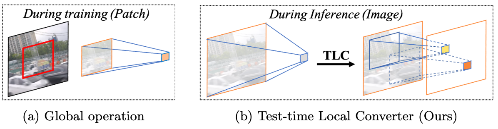

[](https://paperswithcode.com/sota/deblurring-on-gopro?p=revisiting-global-statistics-aggregation-for)
[](https://paperswithcode.com/sota/deblurring-on-hide-trained-on-gopro?p=revisiting-global-statistics-aggregation-for)

# Revisiting Global Statistics Aggregation for Improving Image Restoration
#### Xiaojie Chu, Liangyu Chen, Chengpeng Chen, Xin Lu
#### Paper: https://arxiv.org/pdf/2112.04491.pdf


## Introduction 
This repository is an official implementation of the [TLSC](https://arxiv.org/pdf/2112.04491.pdf). We propose **Test-time Local Statistics Converter (TLSC)**, which replaces the statistic aggregation region from the entire spatial dimension to the local window, to mitigate the issue between training and testing. Our approach has no requirement of retraining or finetuning, and only induces marginal extra costs.



Illustration of training and testing schemes of image restoration. From left to right: image from the dataset; input for the restorer (patches or entire-image depend on the scheme); aggregating statistics from the feature map. For (a), (b), and (c), statistics are aggregated along the entire spatial dimension. (d) Ours, statistics are aggregated in a local region for each pixel. 

### Abstract
> Global spatial statistics, which are aggregated along entire spatial dimensions, are widely used in top-performance image restorers. For example, mean, variance in Instance Normalization (IN) which is adopted by HINet, and global average pooling (ie, mean) in Squeeze and Excitation (SE) which is applied to MPRNet.
This paper first shows that statistics aggregated on the patches-based/entire-image-based feature in the training/testing phase respectively may distribute very differently and lead to performance degradation in image restorers. It has been widely overlooked by previous works.
To solve this issue, we propose a simple approach, Test-time Local Statistics Converter (TLSC), that replaces the region of statistics aggregation operation from global to local, only in the test time. Without retraining or finetuning, our approach significantly improves the image restorer's performance. In particular, by extending SE with TLSC to the state-of-the-art models, MPRNet boost by 0.65 dB in PSNR on GoPro dataset, achieves 33.31 dB, exceeds the previous best result 0.6 dB. In addition, we simply apply TLSC to the high-level vision task, ie, semantic segmentation, and achieves competitive results. Extensive quantity and quality experiments are conducted to demonstrate TLSC solves the issue with marginal costs while significant gain.


## Usage

### Installation

This implementation based on [BasicSR](https://github.com/xinntao/BasicSR) which is a open source toolbox for image/video restoration tasks. 

<!-- ```python
python 3.8.10
pytorch 1.10.0
cuda 10.2
``` -->


```
git clone https://github.com/megvii-research/tlsc.git
cd tlsc
pip install -r requirements.txt
python setup.py develop
```

### Quick Start (Single Image Inference)


* ```python basicsr/demo.py -opt options/demo/demo.yml```
  * modified your [input and output path](https://github.com/megvii-research/tlsc/blob/main/options/demo/demo.yml#L16-L17)
  * [define network](https://github.com/megvii-research/tlsc/blob/main/options/demo/demo.yml#L20-L22)
  * [pretrained model](https://github.com/megvii-research/tlsc/blob/main/options/demo/demo.yml#L26), it should match the define network.
     * for pretrained model, see [here](https://github.com/megvii-research/tlsc/blob/main/experiments/pretrained_models/README.md)

### Main Results
| Method | GoPro | GoPro | HIDE | HIDE | REDS | REDS 
|-------------------------|----------------------------|---------------------------|---------------------------|--------------------------| --------------------------| --------------------------| 
|                         | PSNR                       | SSIM                      | PSNR                      | SSIM                     | PSNR  | SSIM  |        |
| HINet                   | 32.71                      | 0.959                     | 30.33                     | 0.932                    | 28.83 | 0.863 | 
| HINet-local (ours)            | 33.08                      | 0.962                     | 30.66                     | 0.936                    | 28.96 | 0.865 | 
| MPRNet                  | 32.66                      | 0.959                     | 30.96                     | 0.939                    | - | - | 
| MPRNet-local (ours)          | 33.31                      | 0.964                     | 31.19                     | 0.942                    | - | - | 


### Evaluation
<details>
  <summary>Image Deblur - GoPro dataset (Click to expand) </summary>

* prepare data

  * ```mkdir ./datasets/GoPro ```
  
  * download the [test](https://drive.google.com/drive/folders/1a2qKfXWpNuTGOm2-Jex8kfNSzYJLbqkf) set in ./datasets/GoPro/test (refer to [MPRNet](https://github.com/swz30/MPRNet)) 
  * it should be like:
  
    ```bash
    ./datasets/
    ./datasets/GoPro/test/
    ./datasets/GoPro/test/input/
    ./datasets/GoPro/test/target/
    ```

* eval
  * download [pretrained HINet](https://drive.google.com/file/d/1dw8PKVkLfISzNtUu3gqGh83NBO83ZQ5n/view?usp=sharing) to ./experiments/pretrained_models/HINet-GoPro.pth
  * ```python basicsr/test.py -opt options/test/HIDE/MPRNetLocal-HIDE.yml  ```

  * download [pretrained MPRNet](https://drive.google.com/file/d/1QwQUVbk6YVOJViCsOKYNykCsdJSVGRtb/view) to ./experiments/pretrained_models/MPRNet-GoPro.pth
  * ```python basicsr/test.py -opt options/test/HIDE/MPRNetLocal-HIDE.yml  ```
  
</details>

<details>
  <summary>Image Deblur - HIDE dataset (Click to expand) </summary>

* prepare data

  * ```mkdir ./datasets/HIDE ```
  
  * download the [test](https://drive.google.com/drive/folders/1nRsTXj4iTUkTvBhTcGg8cySK8nd3vlhK?usp=sharing) set in ./datasets/HIDE/test (refer to [MPRNet](https://github.com/swz30/MPRNet)) 
  * it should be like:
  
    ```bash
    ./datasets/
    ./datasets/HIDE/test/
    ./datasets/HIDE/test/input/
    ./datasets/HIDE/test/target/
    ```

* eval
  * download [pretrained HINet](https://drive.google.com/file/d/1dw8PKVkLfISzNtUu3gqGh83NBO83ZQ5n/view?usp=sharing) to ./experiments/pretrained_models/HINet-GoPro.pth
  * ```python basicsr/test.py -opt options/test/GoPro/MPRNetLocal-GoPro.yml  ```

  * download [pretrained MPRNet](https://drive.google.com/file/d/1QwQUVbk6YVOJViCsOKYNykCsdJSVGRtb/view) to ./experiments/pretrained_models/MPRNet-GoPro.pth
  * ```python basicsr/test.py -opt options/test/GoPro/MPRNetLocal-GoPro.yml  ```
  
</details>

<details><summary> Image Deblur - REDS dataset (Click to expand) </summary>

* prepare data

  * ```mkdir ./datasets/REDS```

  * download the val set from [val_blur](https://drive.google.com/file/d/1EqQljcGMcm5oCr71KpMfXREPXV3lpMGW/view?usp=sharing), [val_sharp](https://drive.google.com/file/d/1MGeObVQ1-Z29f-myDP7-8c3u0_xECKXq/view?usp=sharing) to ./datasets/REDS/ and unzip them.

  * it should be like

    ```
    ./datasets/
    ./datasets/REDS/
    ./datasets/REDS/val/
    ./datasets/REDS/val/val_blur_jpeg/
    ./datasets/REDS/val/val_sharp/
    ```

  * ```python scripts/data_preparation/reds.py```


    * flatten the folders and extract 300 validation images.

* eval


  * download [pretrained HINet](https://drive.google.com/file/d/1uYH8XvLgrn-Vg6L0NjUcO2Fblhqrc8TU/view?usp=sharing) to ./experiments/pretrained_models/HINet-REDS.pth
  * ```python basicsr/test.py -opt options/test/REDS/HINetLocal-REDS.yml``` 
</details>

> Tricks: Change the 'fast_imp: false' (naive implementation) to 'fast_imp: true' (faster implementation) in MPRNetLocal config can achieve faster inference speed. 


### License

This project is under the MIT license, and it is based on [BasicSR](https://github.com/xinntao/BasicSR) which is under the Apache 2.0 license.


## Citations

If TLSC helps your research or work, please consider citing TLSC.
```
@article{chu2021tlsc,
  title={Revisiting Global Statistics Aggregation for Improving Image Restoration},
  author={Chu, Xiaojie and Chen, Liangyu and and Chen, Chengpeng and Lu, Xin},
  journal={arXiv preprint arXiv:2112.04491},
  year={2021}
}
```

## Contact

If you have any questions, please contact chuxiaojie@megvii.com or chenliangyu@megvii.com.
