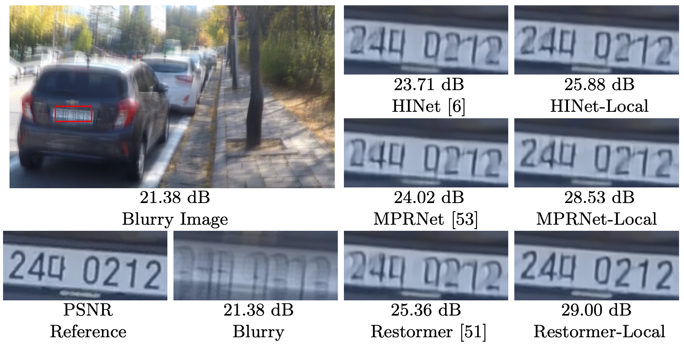

[](https://paperswithcode.com/sota/deblurring-on-gopro?p=revisiting-global-statistics-aggregation-for)
[](https://paperswithcode.com/sota/deblurring-on-hide-trained-on-gopro?p=revisiting-global-statistics-aggregation-for)

# Improving Image Restoration by Revisiting Global Information Aggregation
#### Xiaojie Chu, Liangyu Chen, Chengpeng Chen, Xin Lu
#### Paper: https://arxiv.org/pdf/2112.04491.pdf


## Introduction 
This repository is an official implementation of the [TLC](https://arxiv.org/pdf/2112.04491.pdf). We propose **Test-time Local Converter (TLC)**, which convert the global operation to a local one so that it extract representations based on local spatial region of features as in training phase. Our approach has no requirement of retraining or finetuning, and only induces marginal extra costs.


### Abstract
> Global operations, such as global average pooling, are widely used in top-performance image restorers. They aggregate global information from input features along entire spatial dimensions but behave differently during training and inference in image restoration tasks: they are based on different regions, namely the cropped patches (from images) and the full-resolution images. This paper revisits global information aggregation and finds that the image-based features during inference have a different distribution than the patch-based features during training. This train-test inconsistency negatively impacts the performance of models, which is severely overlooked by previous works. To reduce the inconsistency and improve test-time performance, we propose a simple method called Test-time Local Converter (TLC). Our TLC converts global operations to local ones only during inference so that they aggregate features within local spatial regions rather than the entire large images. The proposed method can be applied to various global modules (e.g., normalization, channel and spatial attention) with negligible costs. Without the need for any fine-tuning, TLC improves state-of-the-art results on several image restoration tasks, including single-image motion deblurring, video deblurring, defocus deblurring, and image denoising. In particular, with TLC, our Restormer-Local improves the state-of-the-art result in single image deblurring from 32.92 dB to 33.57 dB on GoPro dataset.


## Usage

### Installation

This implementation based on [BasicSR](https://github.com/xinntao/BasicSR) which is a open source toolbox for image/video restoration tasks. 

<!-- ```python
python 3.8.10
pytorch 1.10.0
cuda 10.2
``` -->


```
git clone https://github.com/megvii-research/tlc.git
cd tlc
pip install -r requirements.txt
python setup.py develop
```

### Quick Start (Single Image Inference)


* ```python basicsr/demo.py -opt options/demo/demo.yml```
  * modified your [input and output path](https://github.com/megvii-research/tlc/blob/main/options/demo/demo.yml#L16-L17)
  * [define network](https://github.com/megvii-research/tlc/blob/main/options/demo/demo.yml#L20-L22)
  * [pretrained model](https://github.com/megvii-research/tlc/blob/main/options/demo/demo.yml#L26), it should match the define network.
     * for pretrained model, see [here](https://github.com/megvii-research/tlc/blob/main/experiments/pretrained_models/README.md)

### Main Results
Models with our TLC are denoted with -Local suffix.
|Method|GoPro|HIDE|
|---|---|---|
|HINet|32.71|30.33|
|HINet-Local (ours)|33.08 (+0.37)|30.66 (+0.33)|
|MPRNet|32.66 |30.96 |
|MPRNet-Local (ours)|33.31 (+0.65)|31.19 (+0.23)|
|Restormer|32.92 |31.22 |
|Restormer-Local (ours)|33.57 (+0.65)|31.49 (+0.27)|



### Evaluation
<details>
  <summary>Image Deblur - GoPro dataset (Click to expand) </summary>

* prepare data

  * ```mkdir ./datasets/GoPro ```
  
  * download the [test](https://drive.google.com/drive/folders/1a2qKfXWpNuTGOm2-Jex8kfNSzYJLbqkf) set in ./datasets/GoPro/test (refer to [MPRNet](https://github.com/swz30/MPRNet)) 
  * it should be like:
  
    ```bash
    ./datasets/
    ./datasets/GoPro/test/
    ./datasets/GoPro/test/input/
    ./datasets/GoPro/test/target/
    ```

* eval
  * download [pretrained HINet](https://drive.google.com/file/d/1dw8PKVkLfISzNtUu3gqGh83NBO83ZQ5n/view?usp=sharing) to ./experiments/pretrained_models/HINet-GoPro.pth
  * ```python basicsr/test.py -opt options/test/GoPro/MPRNetLocal-GoPro.yml  ```

  * download [pretrained MPRNet](https://drive.google.com/file/d/1QwQUVbk6YVOJViCsOKYNykCsdJSVGRtb/view) to ./experiments/pretrained_models/MPRNet-GoPro.pth
  * ```python basicsr/test.py -opt options/test/GoPro/MPRNetLocal-GoPro.yml  ```

  * download [pretrained Restormer](https://drive.google.com/file/d/1pwcOhDS5Erzk8yfAbu7pXTud606SB4-L/view?usp=sharing) to ./experiments/pretrained_models/Restormer-GoPro.pth
  * ```python basicsr/test.py -opt options/test/GoPro/MPRNetLocal-GoPro.yml  ```
  
</details>

<details>
  <summary>Image Deblur - HIDE dataset (Click to expand) </summary>

* prepare data

  * ```mkdir ./datasets/HIDE ```
  
  * download the [test](https://drive.google.com/drive/folders/1nRsTXj4iTUkTvBhTcGg8cySK8nd3vlhK?usp=sharing) set in ./datasets/HIDE/test (refer to [MPRNet](https://github.com/swz30/MPRNet)) 
  * it should be like:
  
    ```bash
    ./datasets/
    ./datasets/HIDE/test/
    ./datasets/HIDE/test/input/
    ./datasets/HIDE/test/target/
    ```

* eval
  * download [pretrained HINet](https://drive.google.com/file/d/1dw8PKVkLfISzNtUu3gqGh83NBO83ZQ5n/view?usp=sharing) to ./experiments/pretrained_models/HINet-GoPro.pth
  * ```python basicsr/test.py -opt options/test/HIDE/MPRNetLocal-HIDE.yml  ```

  * download [pretrained MPRNet](https://drive.google.com/file/d/1QwQUVbk6YVOJViCsOKYNykCsdJSVGRtb/view) to ./experiments/pretrained_models/MPRNet-GoPro.pth
  * ```python basicsr/test.py -opt options/test/HIDE/MPRNetLocal-HIDE.yml  ```

  * download [pretrained Restormer](https://drive.google.com/file/d/1pwcOhDS5Erzk8yfAbu7pXTud606SB4-L/view?usp=sharing) to ./experiments/pretrained_models/Restormer-GoPro.pth
  * ```python basicsr/test.py -opt options/test/HIDE/MPRNetLocal-HIDE.yml  ```
  
</details>
<!-- 
<details><summary> Image Deblur - REDS dataset (Click to expand) </summary>

* prepare data

  * ```mkdir ./datasets/REDS```

  * download the val set from [val_blur](https://drive.google.com/file/d/1EqQljcGMcm5oCr71KpMfXREPXV3lpMGW/view?usp=sharing), [val_sharp](https://drive.google.com/file/d/1MGeObVQ1-Z29f-myDP7-8c3u0_xECKXq/view?usp=sharing) to ./datasets/REDS/ and unzip them.

  * it should be like

    ```
    ./datasets/
    ./datasets/REDS/
    ./datasets/REDS/val/
    ./datasets/REDS/val/val_blur_jpeg/
    ./datasets/REDS/val/val_sharp/
    ```

  * ```python scripts/data_preparation/reds.py```


    * flatten the folders and extract 300 validation images.

* eval


  * download [pretrained HINet](https://drive.google.com/file/d/1uYH8XvLgrn-Vg6L0NjUcO2Fblhqrc8TU/view?usp=sharing) to ./experiments/pretrained_models/HINet-REDS.pth
  * ```python basicsr/test.py -opt options/test/REDS/HINetLocal-REDS.yml```  -->
</details>

> Tricks: Change the 'fast_imp: false' (naive implementation) to 'fast_imp: true' (faster implementation) in MPRNetLocal config can achieve faster inference speed. 


### License

This project is under the MIT license, and it is based on [BasicSR](https://github.com/xinntao/BasicSR) which is under the Apache 2.0 license.


## Citations

If tlc helps your research or work, please consider citing tlc.
```
@article{chu2021tlc,
  title={Improving Image Restoration by Revisiting Global Information Aggregation},
  author={Chu, Xiaojie and Chen, Liangyu and and Chen, Chengpeng and Lu, Xin},
  journal={arXiv preprint arXiv:2112.04491},
  year={2021}
}
```

## Contact

If you have any questions, please contact chuxiaojie@megvii.com or chenliangyu@megvii.com.
